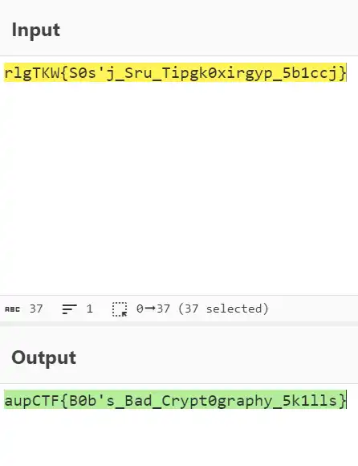
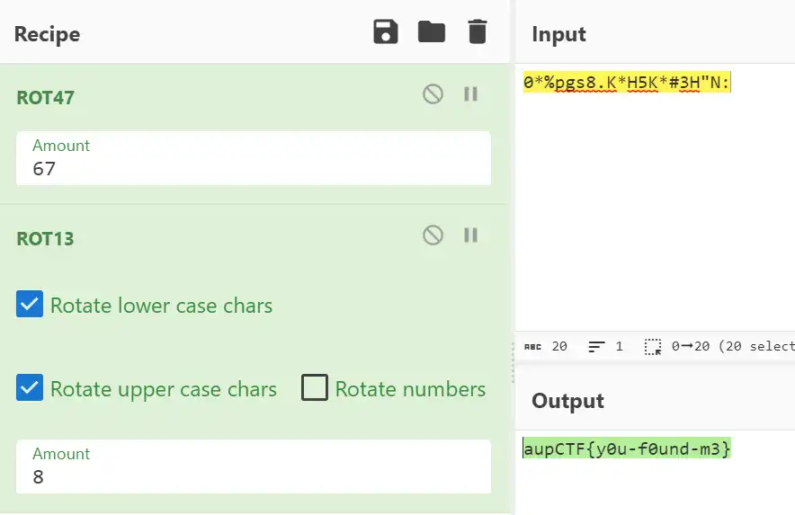
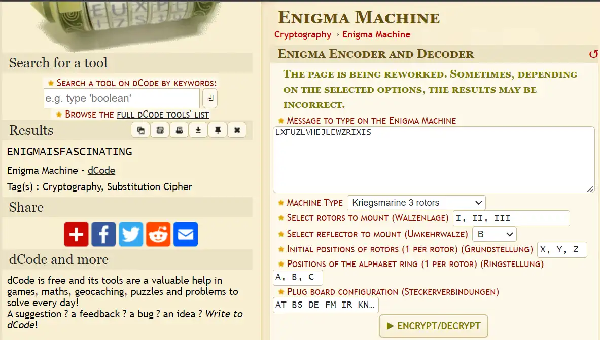
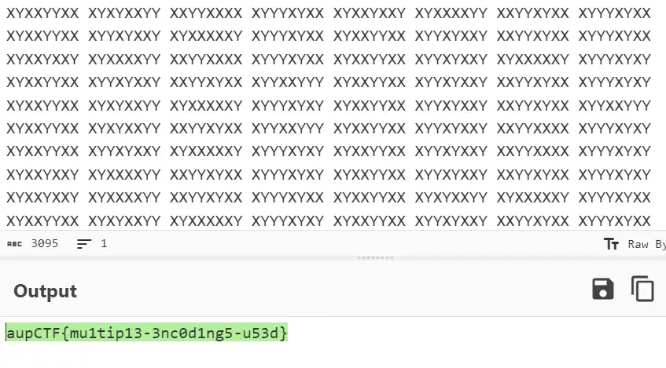

# Cryptography

&#x20; challenge info &#x20;

| Name:       | `Ancient Cipher`                            |
| ----------- | ------------------------------------------- |
| Category:   | `Cryptography`                              |
| Difficulty: | `Easy`                                      |
| Points:     | `100`                                       |
| Link:       | [`aupCTF`](https://tryhackme.com/jr/aupctf) |

### **Ancient Cipher (100pts)** <a href="#ancient-cipher-100pts" id="ancient-cipher-100pts"></a>

#### Description <a href="#description" id="description"></a>

Meet Bob, the world’s worst cryptographer. His encryption skills are so bad that his messages are basically gibberish. One time, he tried to send a secret message to his friend Alice, but it was so poorly encrypted that his dog was able to decode it. Needless to say, Bob’s not winning any cryptography awards anytime soon.

`rlgTKW{S0s'j_Sru_Tipgk0xirgyp_5b1ccj}`

#### Approach <a href="#approach" id="approach"></a>

The name of the challenge implies an ancient cipher, which commonly refers to the Caesar cipher.



&#x20; flag  `aupCTF{B0b's_Bad_Crypt0graphy_5k1lls}`  challenge info &#x20;

| Name:       | `Rotation`                                  |
| ----------- | ------------------------------------------- |
| Category:   | `Cryptography`                              |
| Difficulty: | `Easy`                                      |
| Points:     | `100`                                       |
| Link:       | [`aupCTF`](https://tryhackme.com/jr/aupctf) |

### **Rotation (100pts)** <a href="#rotation-100pts" id="rotation-100pts"></a>

#### Description <a href="#description-1" id="description-1"></a>

We’ve employed a unique technique to encode the message, one that goes beyond the traditional limits of the Caesar cipher. Keep your wits about you and explore every possible avenue - the answer may be closer than you think

`2FAr%uLJ_F\7_F?5\>bN`

#### Approach <a href="#approach-1" id="approach-1"></a>

The challenge name suggests a rotation cipher, but it doesn’t appear to be a simple rotation like ROT13. Since the ciphertext does not include the characters “{}” that would remain unchanged in ROT13, we can explore the possibility of using ROT47 as an alternative rotation cipher.


Now the ciphertext appears to resemble ROT13, so it’s worth attempting that ROT13.



&#x20; flag  `aupCTF{B0b's_Bad_Crypt0graphy_5k1lls}`  challenge info &#x20;

| Name:       | `Enigma`                                    |
| ----------- | ------------------------------------------- |
| Category:   | `Cryptography`                              |
| Difficulty: | `Easy`                                      |
| Points:     | `100`                                       |
| Link:       | [`aupCTF`](https://tryhackme.com/jr/aupctf) |

### **Enigma (100pts)** <a href="#enigma-100pts" id="enigma-100pts"></a>

#### Description <a href="#description-2" id="description-2"></a>

I found an old enigma machine and was messing around with it. can you decipher it

```
MACHINE TYPE: `kriegsmarine 3 rotors`

REFLECTOR: `B`

ROTORS: `I, II, III`

INITIAL POSITIONS OF THE ROTORS: `X, Y, Z`

POSITION OF THE ALPHABET WHEEL: `A, B, C`

PLUGBOARD: `AT BS DE FM IR KN LZ OW PV XY`

CIPHER: `LXFUZLVHEJLEWZRIXIS`

remember to put the flag in format: `aupCTF{answer}` answer in UPPERCASE
```

#### Approach <a href="#approach-2" id="approach-2"></a>

Since all the values are given we can simply put it in a decoder and get the answer



&#x20; flag  `aupCTF{ENIGMAISFASCINATING}`  challenge info &#x20;

| Name:       | `Disorder`                                  |
| ----------- | ------------------------------------------- |
| Category:   | `Cryptography`                              |
| Difficulty: | `Medium`                                    |
| Points:     | `200`                                       |
| Link:       | [`aupCTF`](https://tryhackme.com/jr/aupctf) |

### **Disorder (200pts)** <a href="#disorder-200pts" id="disorder-200pts"></a>

#### Description <a href="#description-3" id="description-3"></a>

`utsa}Ts0aXa{1_eC1ngXph__XF_tmX`

#### Approach <a href="#approach-3" id="approach-3"></a>

It seems that every letter of the flag format “aupCTF{}” is present in the ciphertext. A transposition cipher is a good assumption at this point, as it changes the order of the plaintext.

```
utsa}Ts0aXa{1_eC1ngXph__XF_tmX

By splitting the ciphertext after every 5 letters, 
we can extract the flag by selecting the letters according to the flag format.

utsa}  -- 2nd
Ts0aX  -- 5th
a{1_e  -- 1st
C1ngX  -- 4th
ph__X  -- 3rd
F_tmX  -- 6th

reconstructing the flag

aupCTF{th1s_1s_n0t_a_game}XXXX
```

&#x20; flag  `aupCTF{th1s_1s_n0t_a_game}`    challenge info &#x20;

| Name:       | `Really Secure Algorithm`                   |
| ----------- | ------------------------------------------- |
| Category:   | `Cryptography`                              |
| Difficulty: | `Medium`                                    |
| Points:     | `200`                                       |
| Link:       | [`aupCTF`](https://tryhackme.com/jr/aupctf) |

### **Really Secure Algorithm (200pts)** <a href="#really-secure-algorithm-200pts" id="really-secure-algorithm-200pts"></a>

#### Description <a href="#description-4" id="description-4"></a>

Just remember, the key to success is staying calm, cool, and collected. Oh, and maybe a little bit of math.

**Challenge Files:** [output.txt](https://aupctf.s3.eu-north-1.amazonaws.com/output.txt) [rsa.py](https://aupctf.s3.eu-north-1.amazonaws.com/rsa.py)

#### Approach <a href="#approach-4" id="approach-4"></a>

**rsa.py**

```
from Crypto.Util.number import getStrongPrime, bytes_to_long
f = open("flag.txt").read()
m = bytes_to_long(f.encode())
p = getStrongPrime(512)
q = getStrongPrime(512)
n = p*q
e = 0x10001
c = pow(m,e,n)

print("n =",n)
print("e =",e)
print("c =",c)
print("p + q = ",p + q)
print("p - q = ",p - q)
```

**output**

```
n = 114451512782061350994183549689132403225242966062482357218929786202609314635625168402975465116960672539381904935689924074978793017604108838426275397024126351435336388859375577638687615733448645699186377194544704879027804400841223407182597828299190404980916587708863068950664207317360099871904794302327240026597
e = 0x10001
c = 77973874950946982309998238055233832655056168217930252243355819182449120246116674359138553216317477143768434108918799869104308920311195408379262816485377057853246446992573203590942762693635615621774057306679349618708293741847308966437868706668452083656318895155238523224237514077565164105837790895618179891869
p + q =  21400959789031198835597502268226110838410793429486235013163818172148759394109297013195530163943463063090162742198192075506990494863858727035693527345539878
p - q =  441620610348849769847261104024471204541391170160225757260110727514761526074769013762749528928112909396341014808517549368576708910310103233373547986477636
```

We can find $p$ and $q$ using python

```
from sympy import symbols, Eq, solve

p, q = symbols('p q')

eq1 = Eq((p+q), 21400959789031198835597502268226110838410793429486235013163818172148759394109297013195530163943463063090162742198192075506990494863858727035693527345539878)
eq2 = Eq((p-q), 441620610348849769847261104024471204541391170160225757260110727514761526074769013762749528928112909396341014808517549368576708910310103233373547986477636)

solution = solve((eq1, eq2), (p, q))
print(solution)
```

**output**

```
{p: 10921290199690024302722381686125291021476092299823230385211964449831760460092033013479139846435787986243251878503354812437783601887084415134533537666008757, 
 q: 10479669589341174532875120582100819816934701129663004627951853722316998934017263999716390317507675076846910863694837263069206892976774311901159989679531121}
```

<details>

<summary>Decryption Process</summary>

1. Compute \\(\phi(n) = (p-1)(q-1)\\).
2. Calculate the modular multiplicative inverse of \\(e\\) modulo \\(\phi(n)\\), denoted as \\(d\\), such that \\((d \cdot e) \bmod \phi(n) = 1\\).\
   In python we can use `inverse` function from `Crypto.Util.number`
3. Compute \\(m = c^d \bmod n\\). In python `pow(c, d, n)`.\
   The plaintext message, denoted as \\(m\\), can then be obtained by converting the resulting integer value to its corresponding character representation.

</details>

```
from Crypto.Util.number import long_to_bytes, inverse

p = 10921290199690024302722381686125291021476092299823230385211964449831760460092033013479139846435787986243251878503354812437783601887084415134533537666008757
q = 10479669589341174532875120582100819816934701129663004627951853722316998934017263999716390317507675076846910863694837263069206892976774311901159989679531121

n = p * q
e = 65537  # Converted hex 0x10001 to decimal
phi = (p - 1) * (q - 1)
d = inverse(e, phi)

c = 77973874950946982309998238055233832655056168217930252243355819182449120246116674359138553216317477143768434108918799869104308920311195408379262816485377057853246446992573203590942762693635615621774057306679349618708293741847308966437868706668452083656318895155238523224237514077565164105837790895618179891869
m = pow(c, d, n)

plaintext = long_to_bytes(m)
print(plaintext.decode())
```

&#x20; flag  `aupCTF{3a5y_tw0_3quat10n5_and_hax3d_3}`  challenge info &#x20;

| Name:       | `Swiss Army Knife`                          |
| ----------- | ------------------------------------------- |
| Category:   | `Cryptography`                              |
| Difficulty: | `Medium`                                    |
| Points:     | `200`                                       |
| Link:       | [`aupCTF`](https://tryhackme.com/jr/aupctf) |

### **Swiss Army Knife (200pts)** <a href="#swiss-army-knife-200pts" id="swiss-army-knife-200pts"></a>

#### Description <a href="#description-5" id="description-5"></a>

[decode.txt](https://aupctf.s3.eu-north-1.amazonaws.com/decode.txt)

#### Approach <a href="#approach-5" id="approach-5"></a>

The contents of the file consist solely of ‘X’ and ‘Y’ characters, resembling a binary format. ‘X’ is replaced with ‘0’, and ‘Y’ is replaced with ‘1’.

when we can decode multiple encodings one by one, here is the complete racipe

**Binary —> Base64 —> Morse Code —> Base32 —> Rot13**



&#x20; flag  `aupCTF{mu1tip13-3nc0d1ng5-u53d}`  challenge info &#x20;

| Name:       | `Battista Bet`                              |
| ----------- | ------------------------------------------- |
| Category:   | `Cryptography`                              |
| Difficulty: | `Medium`                                    |
| Points:     | `200`                                       |
| Link:       | [`aupCTF`](https://tryhackme.com/jr/aupctf) |

### **Battista Bet (200pts)** <a href="#battista-bet-200pts" id="battista-bet-200pts"></a>

#### Description <a href="#description-6" id="description-6"></a>

My friend is a big fan of the famous Italian cryptographer **Giovan Battista Bellaso**, he has challenged me to crack this ciphertext. I have been struggling to decode it, Can you help me out

**`syrTXY{T3pnr50A0ndhD3Gv0nv}`**

Hint💡: The key to decode the message is a **SECRET**

#### Approach <a href="#approach-6" id="approach-6"></a>

from the description its clear that vigenere cipher is used and the key is secret


&#x20; flag  `aupCTF{B3lla50W0uldB3Pr0ud}`
